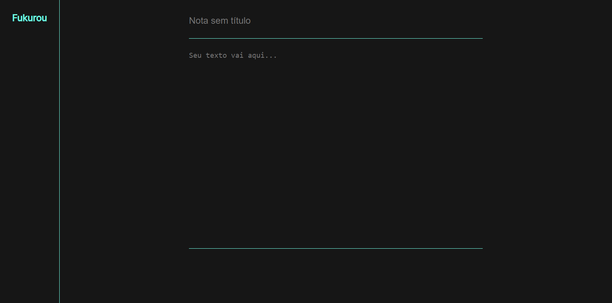

# Prova de Conceito | Fukurou (:brazil:)


> 🦉 Fukurou vai ser uma extensão para o navegador. Eu estava com dúvidas sobre o funcionamento da tag `textarea` e de outros elementos (HTML), então eu decidi testar por conta própria.

### 🖼 Imagens

Você pode acessar o site e ver com seus próprios olhos: [poc-fukurou](https://kauefraga.github.io/poc-fukurou).



## ⬇ Como instalar e rodar

1. Clonar o repositório
2. Abrir o arquivo `index.html` no navegador ou instalar o pacote [Serve](https://www.npmjs.com/package/serve) pelo NPM.

```bash
# (1)
git clone https://github.com/kauefraga/poc-fukurou.git
cd poc-fukurou

# (2)
./index.html

# Ou use o Serve

npm i -g serve # use o gerenciador de pacote que preferir
serve
```

Para desenvolver essa prova de conceito utilizei uma extensão do Visual Studio Code, [Live Server](https://marketplace.visualstudio.com/items?itemName=ritwickdey.LiveServer). Essa extensão possui hot reloading e é muito prática.

## ⚡ Pontos a melhorar

- Acessibilidade
- Organizar o CSS e aderir alguma convenção para torna-lo consistente

## 🧻 Recursos e inspirações

Lista de conteúdos e referências que consumi para criar este projeto:

- HTML/CSS - A dupla dinâmica.
- [Live Server](https://marketplace.visualstudio.com/items?itemName=ritwickdey.LiveServer).
- [Ícones](https://icones.js.org/collection/tdesign).
- [Extensão Notepado](https://chrome.google.com/webstore/detail/notepado/mjmbjjekpfbhmhbicijmjaogbgfbdmbm) - Adorei o design simplificado e o fato de ser uma extensão para a página inicial do navegador.

## 📝 Licença

Este projeto está sob licença do MIT - Veja a [LICENÇA](https://github.com/kauefraga/poc-fukurou/blob/main/LICENSE) para mais informações.
